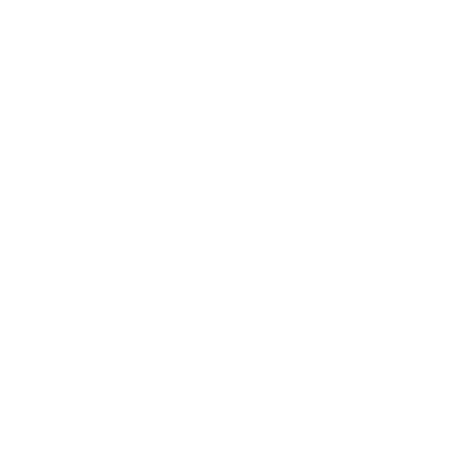

# Hello there! 👋 Welcome to my GitHub profile!

  

I'm Vinícius Gabriel, a developer working in the information technology industry.

Please take a look at my [personal website 🌐](https://monambike.github.io)!

## I Love

🗃️ To keep things organized, so when I need them, I'm ready 😎 just need to use it;

⏫ Using a lot of shortcuts, things get pretty less slow, boring and massive, everything gets much more easier;

🤖 Automation, why I'm gonna do something that can be done exactly the same by somebody else? Beep-Boop!

## I Love..

🎮 Playing games;

🎨 Drawing and design;

💬 Stickers;

🐱 Cattos;

🦐 And shrimps 😋.

## I work with

Unity - C# - Visual Studio - SQL Server

  
  
  
  
  

HTML5 - CSS3 - Sass - Visual Studio Code

  
  
  
  

